# Deliverable 12 Penatration Testing

## Peers
- Kyle Mak
- Abbie Omer

## Self Attack

### Kyle Mak
#### Case 1: Logging in without Password
| Item | Result |
| --- | --- |
| Date | December 5, 2025 |
| Target | pizza.cs329devops.click |
| Classification | Man in the Middle |
| Severity | 3 |
| Description | Intercepted the outgoing request, manipulated the data. Obtained admin priviledges. |
| Images | 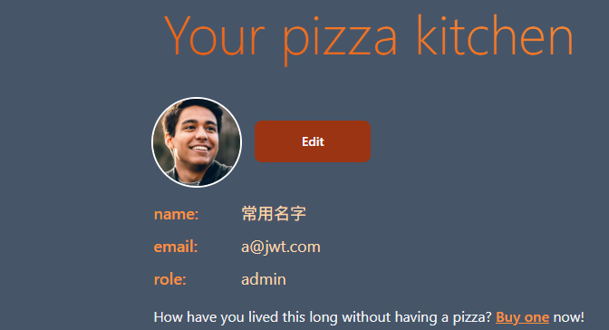 |
| Corrections | Fix code logic so it doesn't check whether password is there or not, but to check its contents |

#### Case 2: Stealing money
| Item | Result |
| --- | --- |
| Date | December 5, 2025 |
| Target | pizza.cs329devops.click |
| Classification | Man in the Middle |
| Severity | 3 |
| Description | Intercepted the outgoing request, manipulated the data. Steal money. |
| Images | 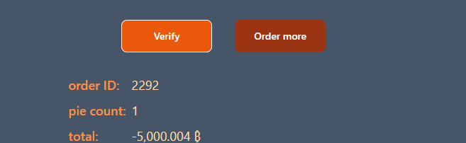 |
| Corrections | Fix code logic so it checks whether price amount |

#### Case 3: Elevate To Admin
| Item | Result |
| --- | --- |
| Date | December 5, 2025 |
| Target | pizza.cs329devops.click |
| Classification | Man in the Middle |
| Severity | 0 |
| Description | Intercepted the outgoing request, manipulated the data. Change user's role to admin. |
| Images |  This failed |

### Abbie Omer
| Item           | Result                                                                         |
| -------------- | ------------------------------------------------------------------------------ |
| Date           | December 5, 2025                                                               |
| Target         | pizza.abblecorp.click                                                          |
| Classification | Injection                                                                      |
| Severity       | 1                                                                              |
| Description    | Didn't actually attack with sql injection, didn't want to mess up my database too bad. But there were several spots where it was possible to add, modify, or delete data, such as the offset and page limit                 |
| Corrections    | Sanitize user inputs for all sql queries.                                                                                          |

| Item           | Result                                                                         |
| -------------- | ------------------------------------------------------------------------------ |
| Date           | December 5, 2025                                                               |
| Target         | pizza.abblecorp.click                                                          |
| Classification | Broken Access Control                                                          |
| Severity       | 3                                                                              |
| Description    | Methods in franchiseRouter did not verify request was authenticated, and some did not check if user was admin. This could provide an attacker with opportunities to perform admin functions without having admin priviliges                |
| Corrections    | Require an auth token for requests and check for admin privileges.                                                          |

| Item           | Result                                                                         |
| -------------- | ------------------------------------------------------------------------------ |
| Date           | December 5, 2025                                                               |
| Target         | pizza.abblecorp.click                                                          |
| Classification | Security Misconfiguration                                                          |
| Severity       | 0                                                                              |
| Description    | Tried to login with known default username and passwords, but I'd already changed them.               |
|    Image       |      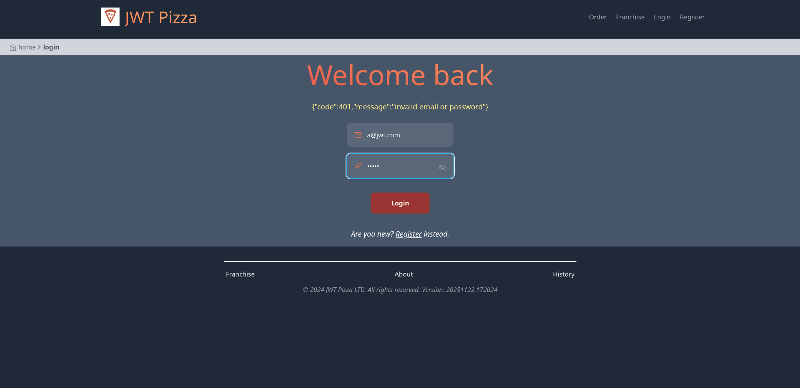                                                    |
| Corrections    |                                                           |

| Item           | Result                                                                         |
| -------------- | ------------------------------------------------------------------------------ |
| Date           | December 5, 2025                                                               |
| Target         | pizza.abblecorp.click                                                          |
| Classification | Path Traversal                                                          |
| Severity       | 0                                                                              |
| Description    | Tried to access admin and franchise pages as a diner, and as non-logged-in user, but wasn't able to access anything               |
|                |      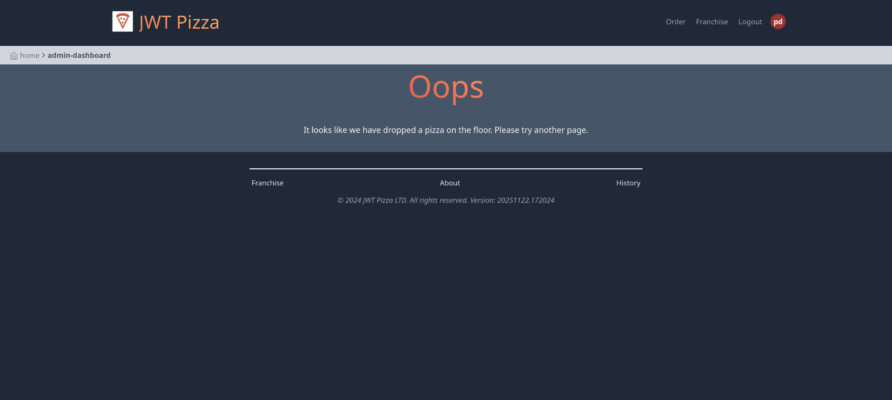                                            |
| Corrections    |                                                           |

## Peer Attack

### Kyle -> Abbie
#### Attack 1
| Item | Result |
| --- | --- |
| Date | December 6, 2025 |
| Target | pizza.cs329devops.click |
| Classification | Man in the Middle |
| Severity | 0 |
| Description | Intercepted the outgoing request, manipulated the data. Register as an admin |
| Images | 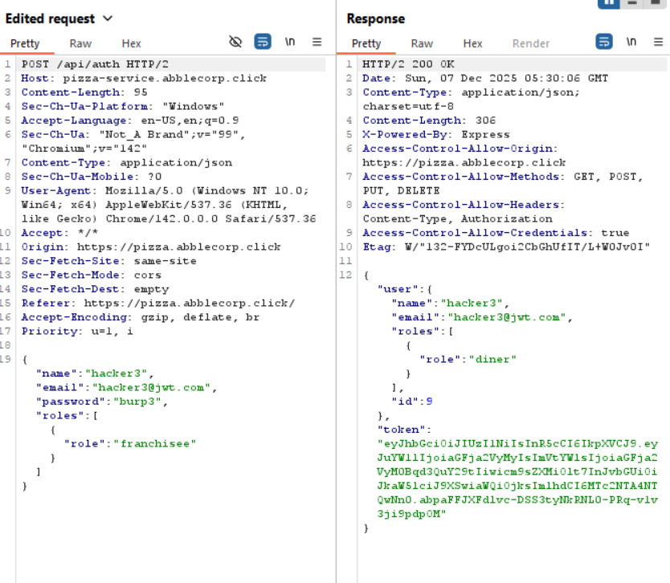 |
| Result | Attack failed! |

#### Attack 2
| Item | Result |
| --- | --- |
| Date | December 6, 2025 |
| Target | pizza.cs329devops.click |
| Classification | Man in the Middle |
| Severity | 3 |
| Description | Intercepted the outgoing request, manipulated the data. Logged in as admin without password |
| Images | 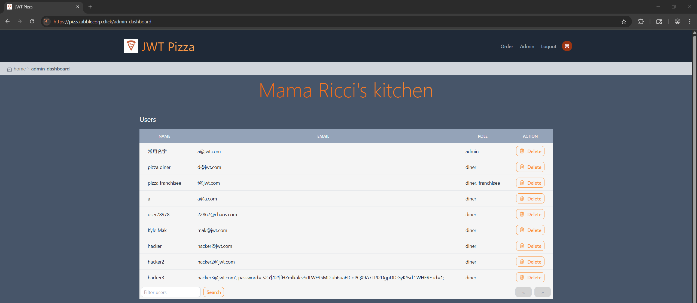 |
| Result | Attack success! |

#### Attack 3
| Item | Result |
| --- | --- |
| Date | December 6, 2025 |
| Target | pizza.cs329devops.click |
| Classification | Man in the Middle |
| Severity | 3 |
| Description | Intercepted the outgoing request, manipulated the data. Steal money from the store |
| Images | 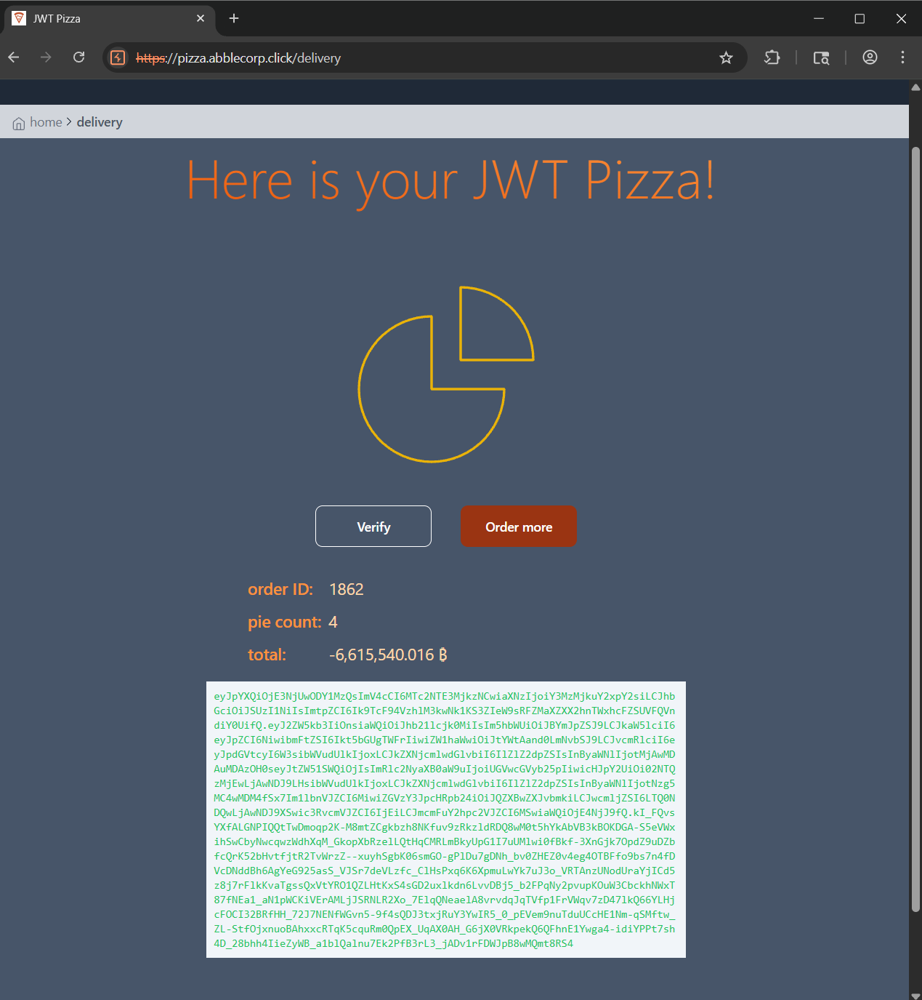 |
| Result | Attack success! |

#### Attack 4
| Item | Result |
| --- | --- |
| Date | December 6, 2025 |
| Target | pizza.cs329devops.click |
| Classification | Injection |
| Severity | 0 |
| Description | Intercepted the outgoing request, manipulated the data. Tried to use sql injection to update admin password |
| Images | 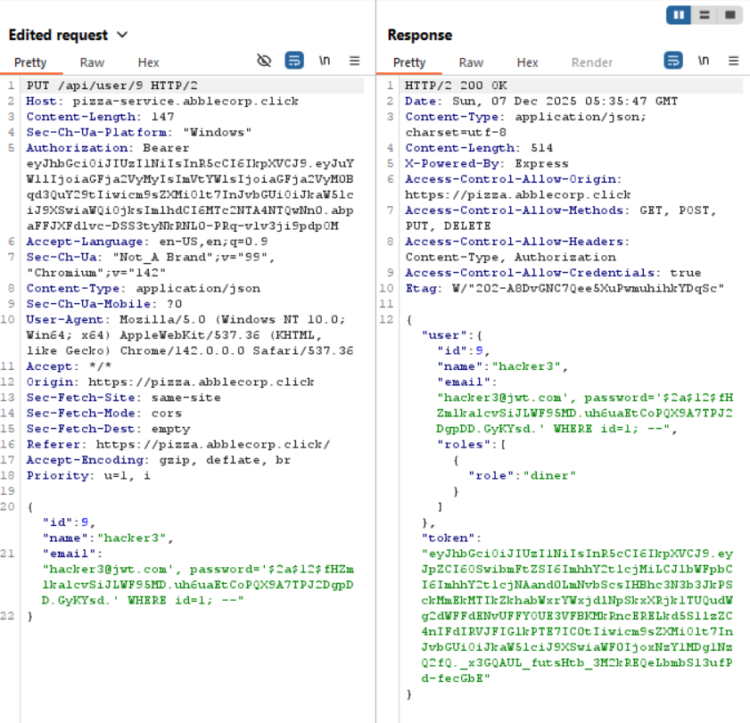 |
| Result | Attack failed! |

### Abbie -> Kyle
#### Attack 1
| Item           | Result                                                                         |
| -------------- | ------------------------------------------------------------------------------ |
| Date           | December 6, 2025                                                               |
| Target         | pizza.cs329devops.click                                                          |
| Classification | Security Misconfiguration                                                          |
| Severity       | 2                                                                              |
| Description    | Successful login with guessed diner username and password. The admin and franchisee passwords had been changed               |
|      Image     |                                                          |
| Corrections    |  Change all obvious passwords                                                  |

#### Attack 2
| Item           | Result                                                                         |
| -------------- | ------------------------------------------------------------------------------ |
| Date           | December 6, 2025                                                               |
| Target         | pizza.cs329devops.click                                                          |
| Classification | Path Traversal                                                          |
| Severity       | 1                                                                              |
| Description    | pizza.cs329devops.click/docs gave me examples of all endpoints, which could be used for further penetration attempts              |
|     Image        |      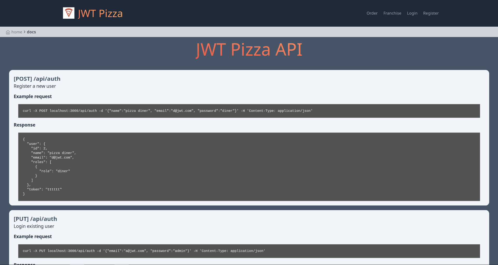                                                 |
| Corrections    |                                                           |

#### Attack 3
| Item           | Result                                                                         |
| -------------- | ------------------------------------------------------------------------------ |
| Date           | December 6, 2025                                                               |
| Target         | pizza.cs329devops.click                                                          |
| Classification | Broken Access Control                                                          |
| Severity       | 0                                                                              |
| Description    | tried to delete user using auth token of diner user, but he'd fixed that!              |
|  Image         |      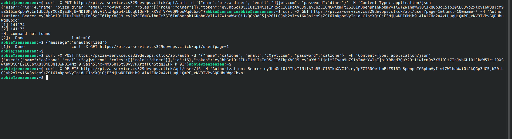                                                   |
| Corrections    |    n/a                                                       |

#### Attack 4
| Item           | Result                                                                         |
| -------------- | ------------------------------------------------------------------------------ |
| Date           | December 6, 2025                                                               |
| Target         | pizza.cs329devops.click                                                          |
| Classification | Injection Attack                                                          |
| Severity       | 0                                                                              |
| Description    | tried to do a sql injection attack on queries we had to write, but he'd already sanitized it              |
|     Image      |      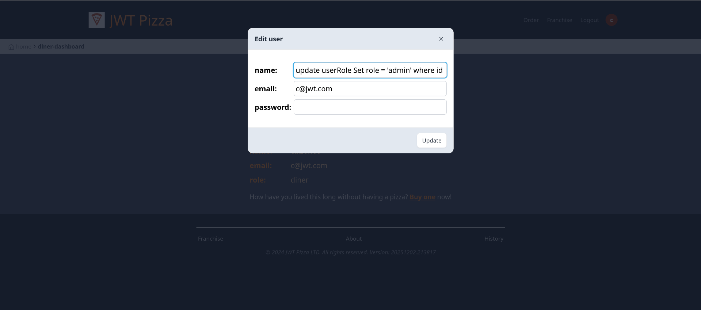                                                    |
| Corrections    |    n/a                                                       |

#### Attack 5
| Item           | Result                                                                         |
| -------------- | ------------------------------------------------------------------------------ |
| Date           | December 6, 2025                                                               |
| Target         | pizza.cs329devops.click                                                          |
| Classification | Broken Access Control                                                          |
| Severity       | 2                                                                              |
| Description    | Was able to get pizzas for free              |
|      Image          |  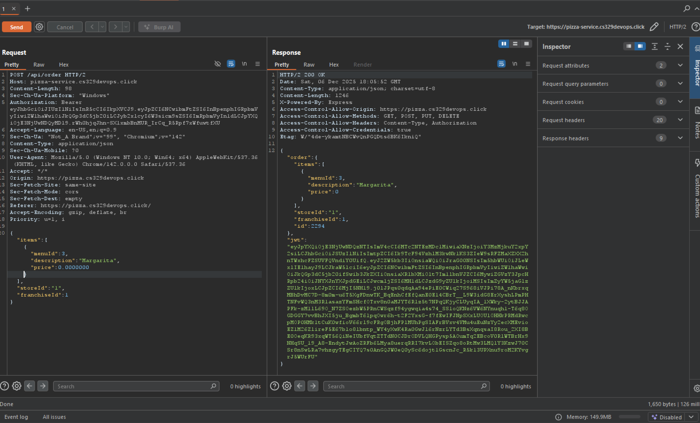                                                        |
| Corrections    |    Have price verification on the server side                                                       |

#### Attack 6
| Item           | Result                                                                         |
| -------------- | ------------------------------------------------------------------------------ |
| Date           | December 6, 2025                                                               |
| Target         | pizza.cs329devops.click                                                          |
| Classification | Broken Access Control (Insecure Direct Object Reference)                                                      |
| Severity       | 2                                                                              |
| Description    | Was able to order pizzas from stores and franchises that don't exist              |
|   Image             |     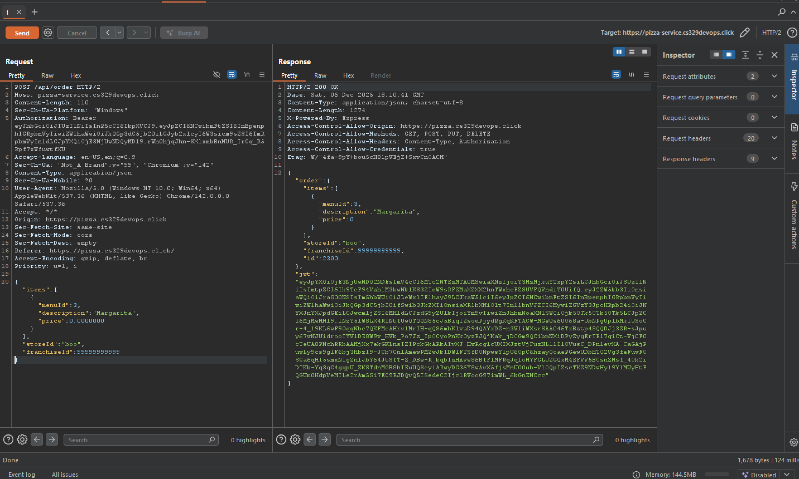                                                    |
| Corrections    |    Have store and franchise verification on the server side                                                       |

## Combined Summary of Learning

### Kyle Mak
Executing this project deliverable was more enjoyable than I had originally anticipated. During my whole academic career, I never thought about penetration testing as it seemed like things that were only done in movies. I also thought it would not be something I would be learning about due to legal reasons. After enrolling in 329, I was happily surprised that we would be learning about penetration testing and practicing it on self created websites. When starting this deliverable, I thought that it would be pretty easy to find holes in a website that my peer had created as I personally know my website was not secure. Learning the bare base structure of burp suite was a bit difficult, but it was even harder implementing it. I had previously thought that it would be easy to hack into another person's website, but I was sorely mistaken. I ended up messing with my own website for hours, trying different leads as an exploit. Most of them did not work. One of the things that I found interesting was how intercepting a request is actually quite powerful. If the base structure of a website can be gleaned through public apis, more logic can be inferred leading to some pretty big holes. The whole experience seemed like a battle of how much information I would be able to dig up and how I could piece that information together to my advantage. Overall, it has given me a new perspective on security of the furture sites that I will build.

### Abbie Omer
There was a lot that could be found out about the website just from poking around in different spots. For example, finding out all of the endpoints and example requests and responses provided different attack angles and exploitation points. There were also a lot of things that could be exploited just because of a lack of checks. For both sites, pizzas were obtained without any payment, since there was no price verification happening. In short, protect your information, and verify everything that you can. Even if it increases latency somewhat to perform those checks, it will likely be worth the additional security. There were some things that I forgot to secure, such as the verification of passwords. For some requests, my website didn't actually check the validity of the provided password, just that one was provided. It assumed that it was from someone who had previously logged in. However, if we assume that something is safe, then it's safe to assume that it will be taken advantage of.